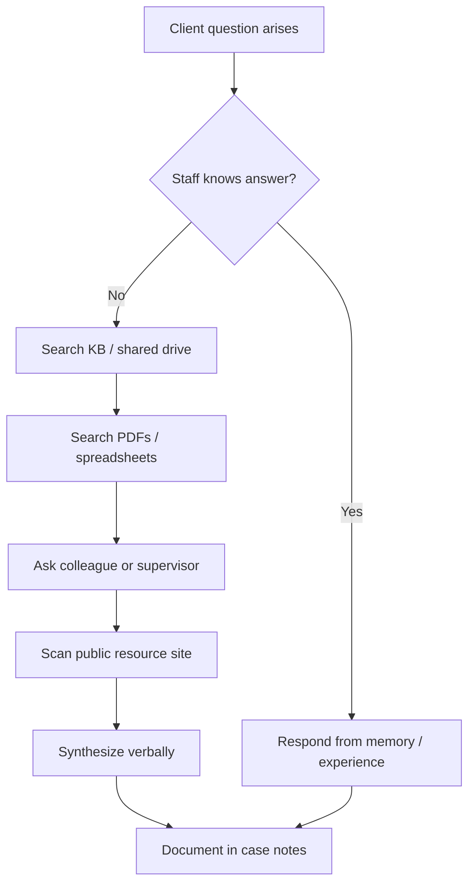
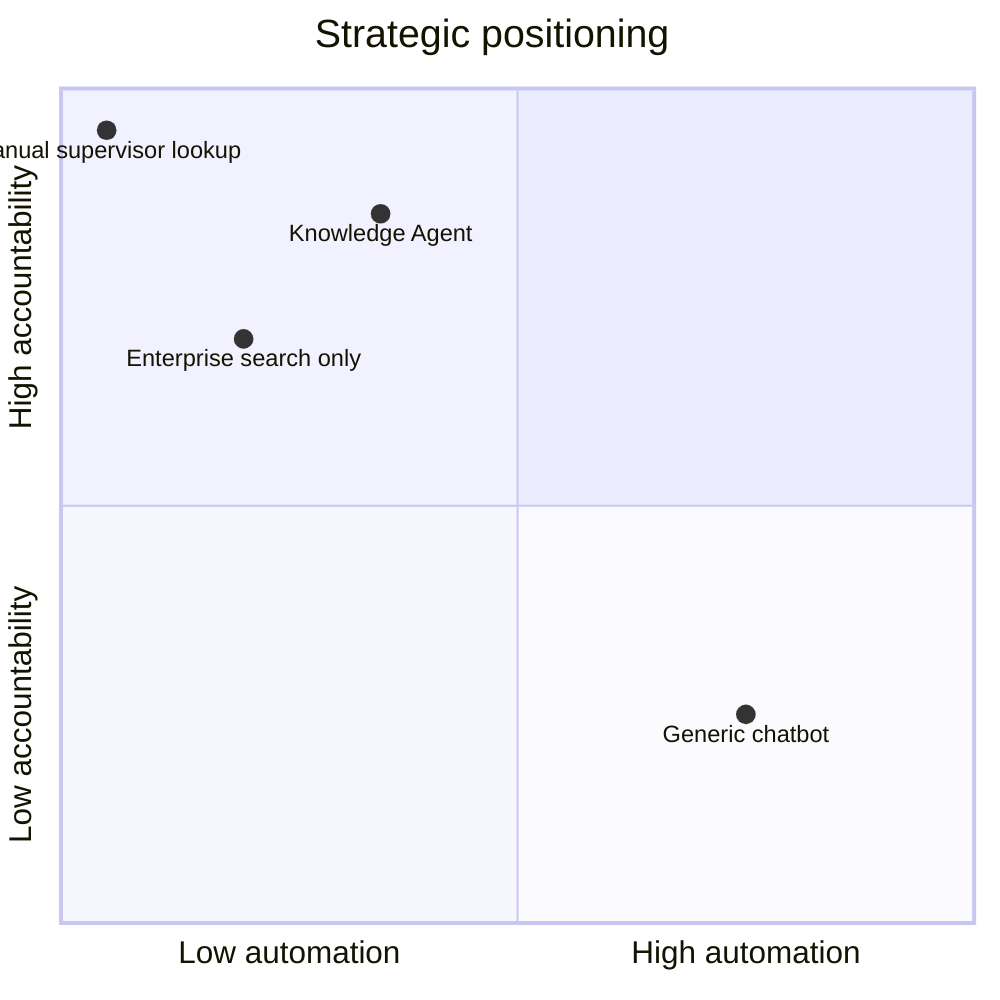

# Opportunity Assessment — Knowledge Agent

**Project:** Knowledge Agent: Human-in-the-Loop Retrieval System for High-Stakes Decision Support  
**Version:** 1.0 · **Status:** Portfolio concept · **Anonymized**

> Impact figures below are **targets for a hypothetical deployment**, not measured portfolio results.

---

## Executive summary

Frontline support organizations maintain extensive approved documentation—but staff still lose minutes (sometimes tens of minutes) per interaction searching fragmented systems. A **grounded Knowledge Agent** can reduce retrieval time, standardize access to approved sources, and improve escalation quality—without automating decisions that require human accountability.

**Target impact (12 months post-GA):**

| Metric | Target direction |
| --- | --- |
| Median time-to-answer (approved info) | −40% vs. baseline |
| Supervisor interrupt rate (repeat lookups) | −25% |
| New-hire time-to-independent lookup | −30% |
| Grounding accuracy on golden set | ≥92% |
| Inappropriate answer rate (no escalation when needed) | <2% |

*Targets are design goals, not measured results.*

---

## Current workflow

**Typical timeline:** 3–12 minutes for non-routine questions; longer for eligibility or multi-program referrals.

**Tools touched per lookup (observed pattern):**

- Internal wiki / KB (often outdated landing pages)
- Shared drive folders (inconsistent naming)
- Referral spreadsheet (version ambiguity)
- Program one-pagers (PDF)
- Public partner websites (not bookmarked consistently)
- Supervisor Slack / walk-up questions

---

## Pain points

| Pain | Who feels it | Evidence pattern |
| --- | --- | --- |
| **Fragmentation** | All frontline roles | 4–6 systems per non-trivial lookup |
| **Stale content** | New + experienced staff | "Which version is current?" |
| **Tribal knowledge** | New hires, float staff | Shadowing dependency |
| **Supervisor load** | Team leads | Repeat "where is X?" questions |
| **Cognitive overload** | Phone/chat workers | Search while maintaining rapport |
| **Inconsistent answers** | Clients | Same question → different resource lists |
| **Training drag** | L&D, ops | KB exists but isn't navigable under pressure |

**Root cause:** Information is **published** but not **retrievable under stress** with **provable provenance**.

---

## User segments

| Segment | Context | Primary need |
| --- | --- | --- |
| **Frontline advocate** | Live phone, chat, in-person | Fast cited answers; low distraction |
| **Intake specialist** | High volume, scripted + exceptions | Eligibility + referral accuracy |
| **Program coordinator** | Cross-program questions | Policy boundaries, handoff rules |
| **Supervisor / SME** | Escalations, QA | Trustworthy summaries to review quickly |
| **L&D / ops** | Onboarding | Observable "how we find answers" path |
| **Content steward** | Governance | Ingestion, freshness, approval workflow |

**Primary MVP persona:** Frontline advocate (80% of query volume in pilot design).

---

## Why now

1. **Staffing pressure** — Higher caseloads; less time per search.
2. **Content volume** — Policy and resource updates accelerated post-program expansion.
3. **Mature RAG patterns** — Retrieval + citation is production-feasible without custom model training.
4. **Risk-aware AI adoption** — Leadership wants assistive AI with audit trails, not autonomous agents.
5. **Onboarding bottleneck** — New hire cohorts need faster path to approved sources.

---

## Expected impact

### Staff experience

- Single query interface across approved corpora
- Citations enable "show your work" in supervision
- Explicit low-confidence → escalation reduces guesswork guilt

### Organizational

- Higher utilization of maintained KB assets (ROI on content investment)
- Reduced duplicate content requests to SMEs
- Clearer signal for outdated documents (failed retrieval clusters)

### Client experience (indirect)

- More consistent resource information
- More staff attention during conversation (less screen-hunting)

---

## Strategic framing

| Lens | Position |
| --- | --- |
| **What we are building** | Approved-information retrieval & navigation layer |
| **What we are not building** | Clinical decision support, risk scoring, client-facing bot |
| **Moat** | Curated corpus + governance + eval discipline + workflow fit |
| **Failure mode to avoid** | "Helpful" hallucinations that erode trust once |
| **Competitive alternative** | Better search UI only (insufficient for synthesis + confidence) |

---

## Recommendation

**Proceed to discovery + MVP PRD** with a **human-in-the-loop retrieval system**, citation-first, scoped to **read-only retrieval** from **approved sources**, explicit **escalation**, and **evaluation-gated rollout**.

**Do not proceed** if leadership expects client-facing automation or clinical guidance in v1.
