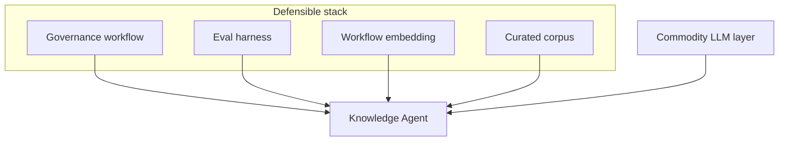

# Product Strategy — Knowledge Agent

**Project:** Knowledge Agent: Human-in-the-Loop Retrieval System for High-Stakes Decision Support  
**Version:** 1.0 · **Horizon:** 18 months · **Anonymized portfolio**

---

## Vision

**Every trained staff member can access approved organizational knowledge in seconds—with proof—while staying present for the people they serve.**

---

## Mission

Build a **human-in-the-loop retrieval system** that makes approved information findable, citable, and governable under operational pressure—without transferring accountability from staff to software.

---

## Product principles

| # | Principle | Operational meaning |
| --- | --- | --- |
| 1 | **Humans decide** | Agent retrieves; staff interpret and act |
| 2 | **Cite or silence** | No unsupported claims; uncertainty is explicit |
| 3 | **Approved corpus only** | No open-web browsing in MVP |
| 4 | **Escalate early** | Low confidence > wrong confidence |
| 5 | **Freshness visible** | Show source version / last-reviewed date |
| 6 | **Eval before expand** | No new corpus without passing eval slice |
| 7 | **Audit by default** | Query, sources, confidence logged |

---

## Strategic bets

### Bet 1 — Grounded RAG beats search UI for stressed users

Staff need **synthesized, scoped answers with citations**—not ten blue links. We bet retrieval + constrained generation + citation enforcement improves time-to-trustworthy-answer vs. Elasticsearch alone.

### Bet 2 — Escalation UX is a feature, not failure

Organizations will adopt AI assist only if **"I don't know"** is safe. We bet visible escalation increases usage vs. hidden low-confidence answers.

### Bet 3 — Governance is the moat

The winning product is not the best model—it is the best **approved corpus + review workflow + eval loop**.

### Bet 4 — Start narrow, prove safety, then widen corpus

MVP = 3 source families covering ~70% of pilot queries. Expansion is **earned** through eval gates.

---

## Non-goals (explicit)

| Non-goal | Why |
| --- | --- |
| Client-facing chatbot | Safety, consent, scope |
| Clinical / diagnostic guidance | Out of scope; regulatory risk |
| Risk scoring or triage automation | Human judgment required |
| Automated case documentation | MVP focuses on retrieval only |
| Real-time open-web search | Unapproved sources |
| Replacing supervisors | Augment, not authority transfer |
| Multi-language GA in v1 | English pilot first |

---

## Differentiation

| Alternative | Limitation | Knowledge Agent advantage |
| --- | --- | --- |
| Ctrl+F across PDFs | No synthesis; version chaos | Unified query + ranking |
| Generic ChatGPT | No approved corpus; hallucination | Grounded + cited + logged |
| Enterprise search (SharePoint) | Poor NL; weak summaries | NL + summary + confidence |
| Printed cheat sheets | Stale day one | Versioned + freshness signals |
| Ask supervisor | Doesn't scale | Escalation only when needed |

---

## Strategic roadmap (phases)

| Phase | Focus | Exit criterion |
| --- | --- | --- |
| **0 — Discovery** | Research, corpus selection | PRD approved |
| **1 — Alpha** | 1 site, 50 users, 3 source types | Safety + grounding gates pass |
| **2 — Beta** | 3 sites, expanded corpus | Adoption + SME satisfaction targets |
| **3 — GA** | Org-wide, training integrated | Ops runbook + steward SLA live |

---

## Open strategic questions

1. Should supervisors receive async escalation queue or synchronous ping?
2. Is voice input in scope for phone workers (Phase 2)?
3. How do union / works councils perceive query logging?
4. Partner content (external PDFs)—inclusion criteria for Phase 2?
