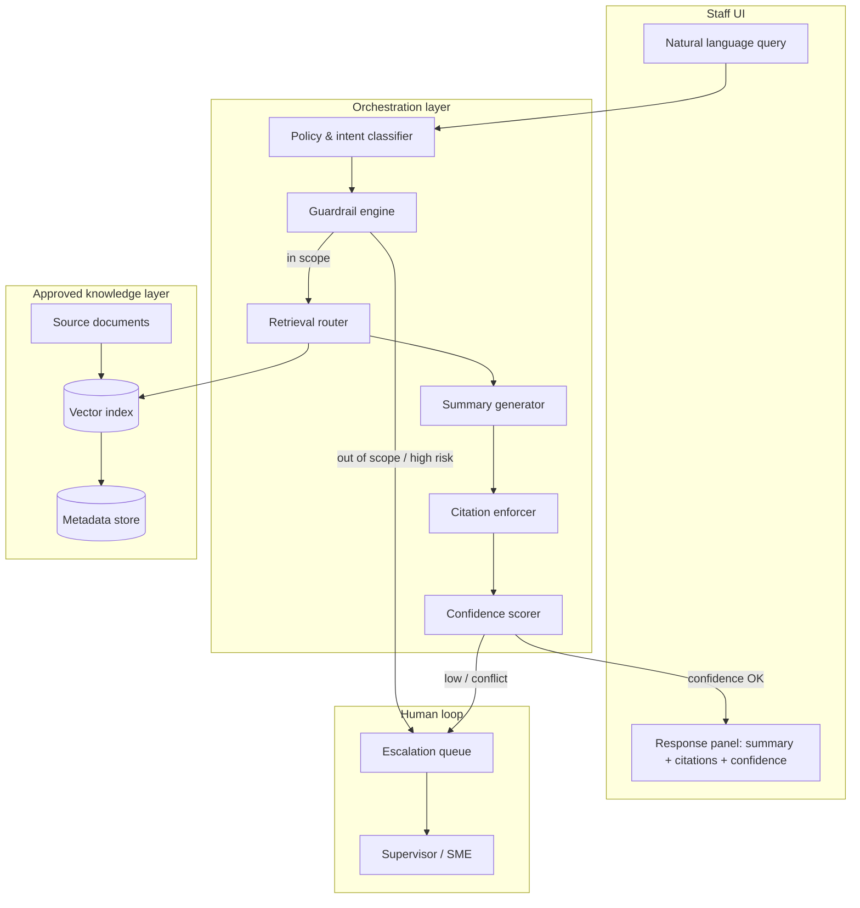
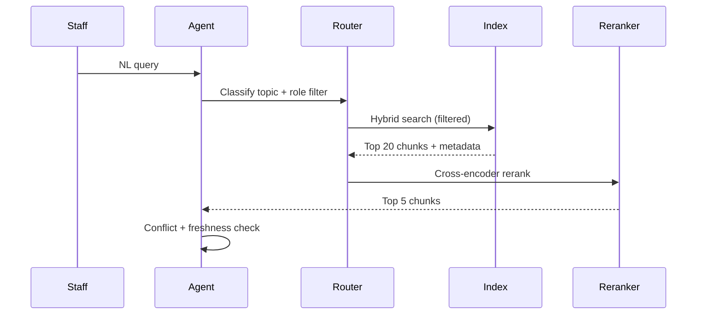
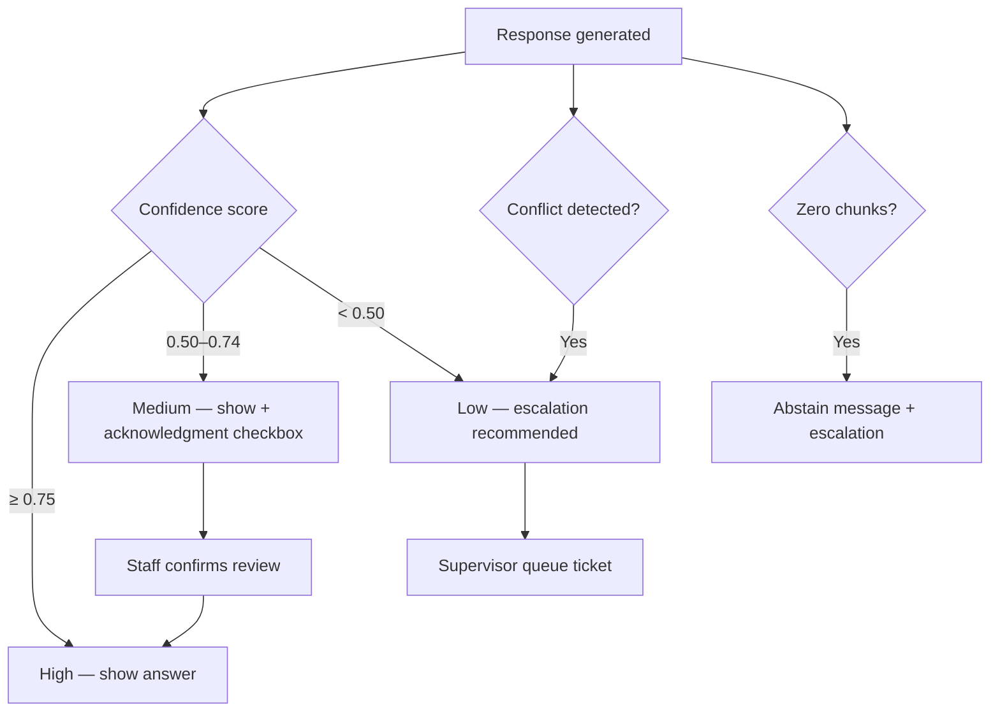

# Agent Architecture — Knowledge Agent

**Project:** Knowledge Agent: Human-in-the-Loop Retrieval System for High-Stakes Decision Support  
**Version:** 1.0 · **Anonymized portfolio design**

> System design specification—not a deployed production architecture.

---

## System overview

Knowledge Agent is a **constrained retrieval-augmentation pipeline** with a **guardrail layer** and **mandatory citation post-processing**. It is not a general-purpose autonomous agent.



---

## Agent flow (step-by-step)

| Step | Component | Action |
| --- | --- | --- |
| 1 | **Auth** | Verify staff role + site |
| 2 | **Intent & policy classifier** | Detect query category; block OOS / clinical / client-direct |
| 3 | **Query rewrite** | Expand acronyms; add program synonyms (rules + light LLM) |
| 4 | **Retrieval router** | Select index partition(s) by role + topic |
| 5 | **Hybrid retrieval** | BM25 + vector top-k (k=20) → rerank to top 5 |
| 6 | **Guardrail pre-gen** | Drop chunks below relevance threshold; flag conflicts |
| 7 | **Summary generation** | LLM: summarize **only** from provided chunks |
| 8 | **Citation enforcer** | Every sentence mapped to chunk ID or removed |
| 9 | **Confidence scorer** | Aggregate retrieval + citation coverage + conflict signals |
| 10 | **Response policy** | High/Medium → staff UI; Low / conflict → escalation |
| 11 | **Audit log** | Persist query, chunks, output, scores |

---

## Retrieval flow



**Source ranking signals (weighted):**

| Signal | Weight | Notes |
| --- | --- | --- |
| Semantic similarity | 35% | Embedding cosine |
| Keyword match | 20% | Program names, region codes |
| Document authority tier | 20% | SOP > draft FAQ |
| Freshness (`last_reviewed`) | 15% | Penalize >12 months |
| Historical helpfulness | 10% | Staff flags (beta+) |

---

## Guardrail layer

### Input guardrails

- PII detection in query → redact in logs; warn staff not to paste client identifiers
- Out-of-scope taxonomy (clinical, legal advice, risk triage) → block + escalation template
- Prompt injection patterns → strip instructions; retrieval-only mode

### Generation guardrails

- System prompt: *"Answer only from provided context. If insufficient, say so."*
- Max summary length: 180 words
- Banned phrases: *"You should," "I recommend clinically," "Risk level is"*
- Required structure: Summary → Citations → Confidence → Optional next steps (**lookup only**)

### Output guardrails

- Citation coverage check: ≥90% of factual sentences cited
- Unsupported claim detector (NLI-style) → downgrade confidence or block
- Stale source warning if any citation >12 months

---

## Escalation flow



**Escalation ticket payload:**

- Original query (redacted)
- Top chunks considered
- Model draft (if any)
- Reason code: `LOW_CONFIDENCE` | `CONFLICT` | `OOS` | `STALE` | `NO_MATCH`

---

## Confidence scoring

**Composite score (0–1):**

```
confidence = 0.40 * top_chunk_relevance
           + 0.25 * citation_coverage
           + 0.20 * source_authority_avg
           + 0.10 * freshness_factor
           - 0.15 * conflict_penalty
```

| Band | Range | UX |
| --- | --- | --- |
| High | ≥0.75 | Green badge; answer shown |
| Medium | 0.50–0.74 | Amber; "Verify before sharing" |
| Low | <0.50 | Escalation path default |

---

## Example user query and response

### Query (staff)

> Young adult, 19, experiencing housing instability and asking about mental health support options in Region B. What programs can we discuss?

### Agent response (illustrative)

**Summary**  
Region B offers three approved pathways for young adults (18–24): (1) transitional housing through Program Horizon with case management intake [1]; (2) short-term crisis shelter referral via the Regional Housing Line [1][2]; (3) behavioral health referral through Partnership Care when the client is not in active crisis [3]. Eligibility for Program Horizon requires residency in Region B and age 18–24 [1]. This information does not determine client eligibility—you must complete intake assessment.

**Citations**  
1. *Referral Directory — Region B*, v2026.03, reviewed 2026-04-15 — §2.4 Young Adult Housing  
2. *Crisis Intake SOP*, v5.2, reviewed 2026-03-01 — §6.1 Shelter Referral  
3. *Behavioral Health Program One-Pager*, v2026.01, reviewed 2026-02-20  

**Confidence:** Medium (0.68) — Multiple sources; verify current bed availability via Housing Line.  
**Suggested next step:** If client is in immediate safety crisis, follow Crisis Intake SOP §4 (escalation required).

---

## What this architecture deliberately omits

- Multi-agent debate loops (unnecessary complexity for MVP)
- Tool use beyond retrieval (no calendars, CRM, email)
- Client-facing generation
- Online learning from staff feedback without steward review
