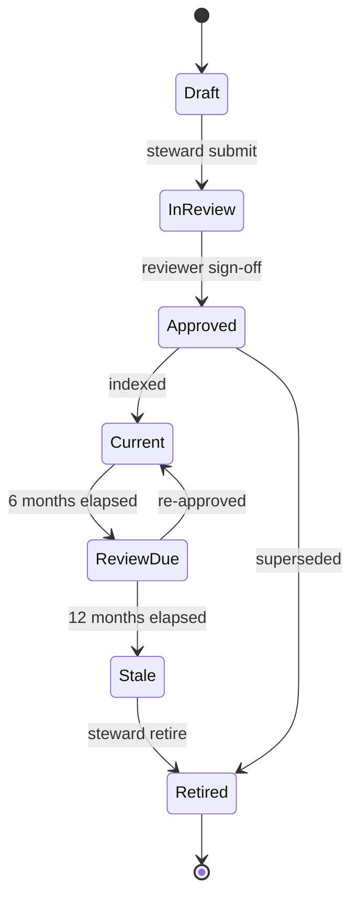
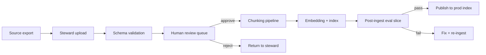

# Knowledge Base Design — Knowledge Agent

**Project:** Knowledge Agent: Human-in-the-Loop Retrieval System for High-Stakes Decision Support  
**Version:** 1.0 · **Anonymized portfolio design**

---

## Design intent

The knowledge base is a **governed corpus**, not a dump of all files. Every indexed asset must be **approved**, **versioned**, **metadata-rich**, and **retrievable with provenance**.

---

## Approved source types (MVP)

| Tier | Source type | Example | Authority |
| --- | --- | --- | --- |
| **A** | Referral directories | Region B resource spreadsheet (export) | Program ops |
| **A** | Eligibility & intake SOPs | Crisis Intake SOP v5.2 | Compliance |
| **B** | Program one-pagers | Behavioral Health overview | Program manager |
| **B** | Training job aids | New hire lookup guide | L&D |
| **C** | Public partner pages (allowlist) | State housing authority FAQ | Steward-approved URL list |

**Not indexed in MVP:** Email threads, draft Google Docs, supervisor personal notes, client records.

---

## Source freshness model

| Status | Definition | Retrieval behavior |
| --- | --- | --- |
| **Current** | `last_reviewed` ≤ 6 months | Full weight |
| **Review due** | 6–12 months | Show amber freshness badge |
| **Stale** | >12 months | Downrank; warn staff; steward alert |
| **Retired** | Marked inactive | Excluded from index |



**Target steward SLA:** Tier A sources reviewed every 6 months; Tier B every 12 months.

---

## Metadata schema

Each chunk carries:

| Field | Type | Required | Example |
| --- | --- | --- | --- |
| `document_id` | UUID | Yes | `doc_8f2a...` |
| `document_title` | string | Yes | Referral Directory — Region B |
| `version` | string | Yes | 2026.03 |
| `last_reviewed` | date | Yes | 2026-04-15 |
| `approved_by` | role | Yes | Program Ops Lead |
| `source_type` | enum | Yes | referral_directory |
| `authority_tier` | A/B/C | Yes | A |
| `program_tags` | string[] | Yes | housing, young_adult |
| `region` | string[] | Yes | region_b |
| `audience_role` | string[] | Yes | frontline, intake |
| `section_path` | string | Yes | §2.4 Young Adult Housing |
| `chunk_id` | UUID | Yes | `chk_91bc...` |
| `effective_date` | date | No | 2026-01-01 |
| `supersedes` | document_id | No | doc_prev... |
| `url_or_path` | string | Yes | Internal doc portal link |

---

## Citation requirements

Every staff-facing answer must include:

1. **Document title**
2. **Version**
3. **Last reviewed date**
4. **Section reference**
5. **Deep link** to source viewer

**Citation format (UI):**

> [1] *Crisis Intake SOP* v5.2 · Reviewed 2026-03-01 · §6.1 Shelter Referral · [Open source]

**Rules:**

- No citation → sentence cannot appear in summary
- Citations must resolve to live approved documents
- If two sources conflict, agent must not merge silently—escalate or present both with conflict flag

---

## Content ingestion workflow



### Chunking rules

- Target chunk size: 400–700 tokens
- Preserve section headers in chunk text
- One chunk ≠ entire 40-page PDF unless structurally atomic
- Tables exported as markdown with header row

### Ingestion SLAs (target)

| Step | SLA |
| --- | --- |
| Schema validation | Automated, immediate |
| Steward review | 2 business days |
| Index publish after approval | 4 hours |

---

## Human review process

### Document approval (pre-index)

| Reviewer | Checks |
| --- | --- |
| **Content steward** | Correct version; metadata complete |
| **Program SME** | Accurate for field use |
| **Compliance liaison** (Tier A only) | Policy alignment |

### Post-release monitoring

- Weekly **stale asset report**
- **Retrieval miss log** — queries with zero chunks → corpus gap tickets
- **Wrong answer flags** → SME review within 3 business days

### Retirement

1. Steward marks document `superseded_by` new version  
2. Old version removed from index within 24h  
3. Redirect deep links to new version where possible  

---

## Example: metadata record (JSON)

```json
{
  "document_id": "doc_8f2a91bc",
  "document_title": "Referral Directory — Region B",
  "version": "2026.03",
  "last_reviewed": "2026-04-15",
  "source_type": "referral_directory",
  "authority_tier": "A",
  "program_tags": ["housing", "young_adult", "behavioral_health"],
  "region": ["region_b"],
  "audience_role": ["frontline", "intake"]
}
```

---

## Corpus expansion gate

New source family requires:

1. Steward SOP for maintenance  
2. ≥25 golden eval questions with expected citations  
3. Alpha eval pass on that slice (≥90% grounding)  
4. Compliance sign-off if Tier A
