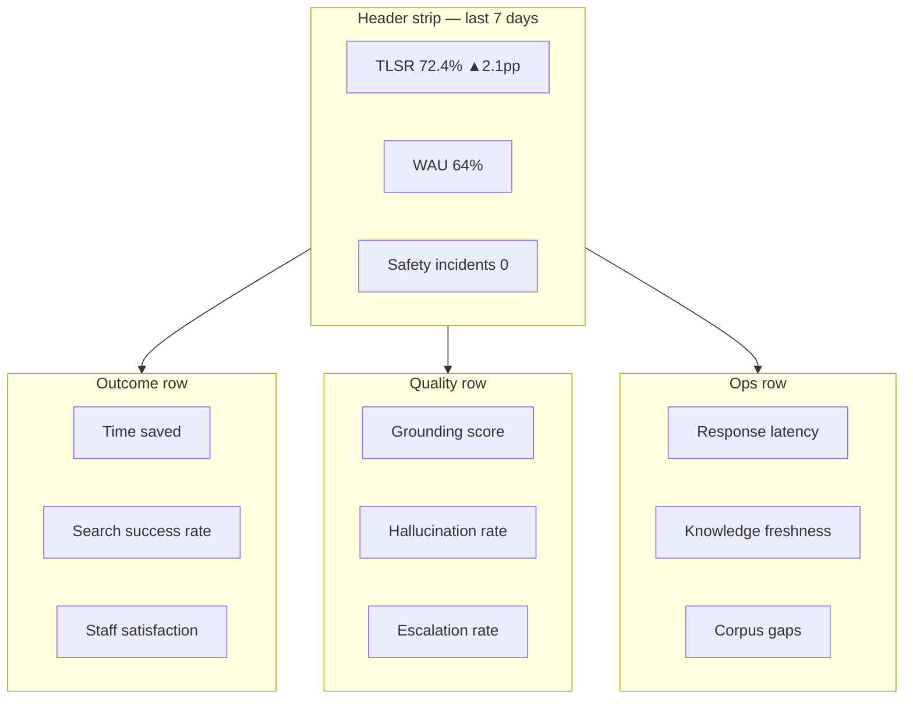
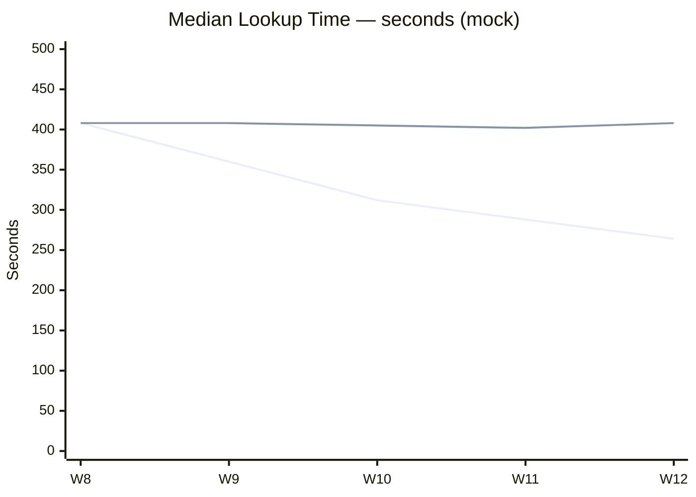
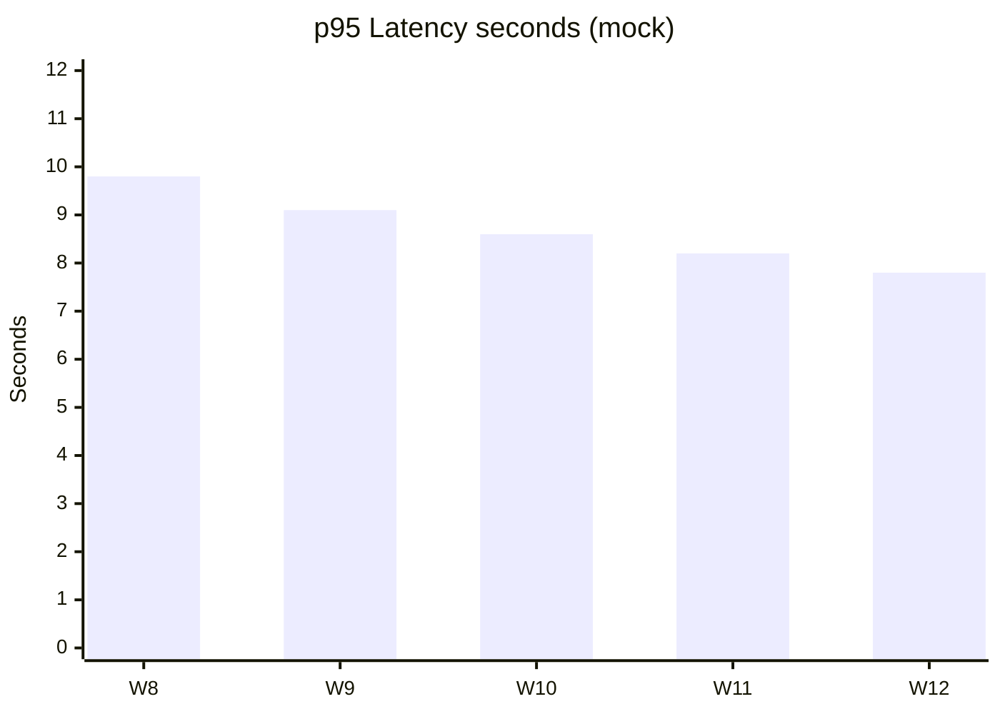

# Metrics Dashboard Mockup — Knowledge Agent

**Project:** Knowledge Agent: Human-in-the-Loop Retrieval System for High-Stakes Decision Support  
**Version:** 1.0 · **Audience:** Product, Ops, Executive sponsor · **Data:** Sample / mock only

---

## Dashboard purpose

Give leadership a **single view of trust and utility** — not vanity query volume. Every panel ties to a decision: expand corpus, tune retrieval, adjust confidence threshold, or pause rollout.

**North Star (pinned):** [Trusted Lookup Success Rate (TLSR)](../07-metrics/kpi-framework.md)

---

## Layout overview



---

## Section 1 — Time saved (outcome)

**Definition:** Estimated minutes saved per lookup vs. baseline time-motion study (self-report + UI timing sample).

| Metric | Sample (Week 12) | Target (GA) | Trend |
| --- | --- | --- | --- |
| Median lookup time (with agent) | 1.2 min | ≤1.5 min | ▼ |
| Median lookup time (baseline) | 6.8 min | — | — |
| **Estimated time saved / lookup** | **5.6 min** | **≥4.0 min** | ▲ |
| Aggregate hours saved (pilot cohort) | 118 hrs | — | ▲ |



*Solid line = with agent · Dashed reference = baseline ~408s*

**PM action trigger:** If time saved flat for 4 weeks → UX friction study (citation clicks, loading).

---

## Section 2 — Search success rate

**Definition:** TLSR — % queries ending in helpful cited answer OR appropriate escalation within 60s.

| Component | Sample | Target |
| --- | --- | --- |
| Helpful cited answer | 58% | ≥55% |
| Appropriate escalation | 16% | 10–20% |
| Failed / abandoned | 14% | <20% |
| **TLSR** | **72.4%** | **≥75% GA** |

| Failure reason (sample) | % of failures |
| --- | --- |
| Zero corpus match | 38% |
| User abandoned during load | 29% |
| Staff marked not helpful | 21% |
| Other | 12% |

**PM action trigger:** Zero-match >40% of failures → steward sprint on corpus gaps.

---

## Section 3 — Grounding score

**Definition:** % factual sentences with valid citation (automated + weekly SME spot check).

| Period | Auto score | SME sample (n=50) | Delta |
| --- | --- | --- | --- |
| Week 11 | 90.1% | 91.0% | +0.9 |
| Week 12 | 91.8% | 92.0% | +0.2 |
| **Target GA** | **≥94%** | **≥92%** | — |

| Slice (Week 12 mock) | Grounding |
| --- | --- |
| housing_instability | 93.2% |
| benefits_eligibility | 88.4% |
| out_of_scope (blocked) | 100% |

---

## Section 4 — Hallucination rate

**Definition:** Unsupported factual claims / total factual sentences (SME-labeled sample).

| Week | Rate | Target |
| --- | --- | --- |
| W10 | 3.8% | <5% alpha |
| W11 | 3.2% | |
| W12 | 2.6% | <3% beta |
| GA target | — | <2% |

**Alert rule:** Any weekly rate >4% → pause corpus expansion; root-cause within 48h.

---

## Section 5 — Escalation rate

**Definition:** Escalations / total queries.

| Metric | Sample | Healthy range |
| --- | --- | --- |
| Escalation rate | 18% | 12–22% |
| Escalation accuracy (SME) | 89% | ≥88% beta |
| Inappropriate escalation (too high) | 6% | <10% |
| Missed escalation (too low) | 5% | <8% |

| Reason code | Share |
| --- | --- |
| LOW_CONFIDENCE | 44% |
| NO_MATCH | 28% |
| CONFLICT | 14% |
| OOS | 11% |
| OTHER | 3% |

**PM action trigger:** Missed escalation >8% → lower confidence threshold or tighten OOS classifier.

---

## Section 6 — Response latency

| Percentile | Sample (W12) | Target |
| --- | --- | --- |
| p50 | 4.2s | — |
| p95 | 7.8s | <8s beta |
| p99 | 11.4s | <12s |
| Timeout rate | 0.6% | <1% |



---

## Section 7 — Counselor / staff satisfaction

**Source:** Weekly 1-question pulse + monthly survey (sample data).

| Question | Sample score | Target |
| --- | --- | --- |
| "This helped me find approved info faster" (1–5) | 4.1 | ≥4.0 |
| "I trust citations enough to verify quickly" (1–5) | 3.9 | ≥3.8 |
| "Escalation when unsure feels safe" (1–5) | 4.3 | ≥4.0 |
| NPS (pilot cohort) | +34 | ≥+25 |

**Verbatim theme (anonymized):**

- ✅ "Citations save me opening five folders."  
- ✅ "I like that it says when it's not sure."  
- ⚠ "Benefits income questions still shaky."  

---

## Section 8 — Knowledge freshness

**Definition:** % Tier A/B documents within review SLA.

| Metric | Sample | Target |
| --- | --- | --- |
| Tier A current (≤6 mo) | 94% | ≥95% |
| Tier B current (≤12 mo) | 88% | ≥90% |
| Stale answers flagged correctly | 91% | ≥90% |
| Open steward tickets | 7 | Decreasing |

| Document (sample) | Status | Action |
| --- | --- | --- |
| Food pantry schedule Q1 | REVIEW_DUE | Steward assigned |
| DV intake SOP | CURRENT | — |
| 2024 youth FAQ (retired) | RETIRED | Removed from index |

---

## Executive summary table (one-glance)

| KPI | Sample | Target | Status |
| --- | --- | --- | --- |
| TLSR | 72.4% | 75% | 🟡 Near |
| Time saved / lookup | 5.6 min | 4.0 min | 🟢 |
| Grounding | 91.8% | 94% GA | 🟡 |
| Hallucination | 2.6% | <2% GA | 🟡 |
| Escalation accuracy | 89% | 90% | 🟡 |
| p95 latency | 7.8s | <8s | 🟢 |
| Staff satisfaction | 4.1/5 | 4.0 | 🟢 |
| Corpus freshness (Tier A) | 94% | 95% | 🟡 |
| Safety incidents | 0 | 0 | 🟢 |

---

## Mock dashboard wireframe (ASCII)

```
┌──────────────────────────────────────────────────────────────────┐
│ Knowledge Agent — Pilot Dashboard          Week 12 · Region B   │
├──────────────┬──────────────┬──────────────┬──────────────────────┤
│ TLSR 72.4%   │ WAU 64%      │ Grounding    │ Safety 0             │
│ ▲ 2.1pp      │ ▲ 3pp        │ 91.8%        │ incidents            │
├──────────────┴──────────────┴──────────────┴──────────────────────┤
│ [Time saved chart]          │ [TLSR breakdown pie]                │
├─────────────────────────────┼─────────────────────────────────────┤
│ [Grounding by slice]        │ [Escalation reasons]                │
├─────────────────────────────┴─────────────────────────────────────┤
│ [Latency p95 trend]         │ [Freshness + corpus gap queue]      │
├───────────────────────────────────────────────────────────────────┤
│ Staff satisfaction 4.1 · Top gap: benefits_eligibility (8 tickets)│
└───────────────────────────────────────────────────────────────────┘
```

---

## Data sources (conceptual)

| Panel | Source |
| --- | --- |
| TLSR, latency | Agent audit log |
| Grounding, hallucination | Eval runner + SME sample |
| Time saved | Baseline study + UI timing |
| Satisfaction | Weekly pulse survey |
| Freshness | Steward metadata store |
| Corpus gaps | Zero-match query cluster |

---

## Related artifacts

- KPI definitions: [`kpi-framework.md`](kpi-framework.md)
- Eval scorecard: [`../06-evaluations/evaluation-scorecard.md`](../06-evaluations/evaluation-scorecard.md)
- Golden dataset: [`../06-evaluations/golden-dataset.csv`](../06-evaluations/golden-dataset.csv)

**Disclaimer:** All values labeled **sample** or **mock** — fictional portfolio data for demonstration.
