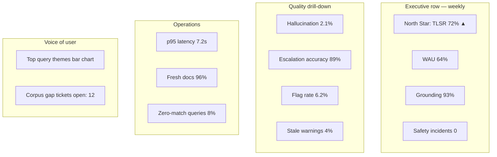

# KPI Framework — Knowledge Agent

**Project:** Knowledge Agent: Human-in-the-Loop Retrieval System for High-Stakes Decision Support  
**Version:** 1.0 · **Anonymized portfolio design**

> Metric targets below are **design targets** for a hypothetical deployment—not measured portfolio results.

---

## Measurement philosophy

Optimize for **trustworthy assistance**, not **maximize answers**. A successful abstention or escalation beats a fluent wrong answer.

---

## North Star metric

**Trusted Lookup Success Rate (TLSR)**

> % of staff queries where the user receives a **cited, staff-confirmed helpful** answer **or** an **appropriate escalation** within 60 seconds.

**Target (GA +90 days):** ≥75% TLSR on pilot programs.

**Why this metric:** Combines utility, grounding, and safety into one outcome staff and leadership can align on.

---

## Input metrics (leading)

| Metric | Definition | Target trend |
| --- | --- | --- |
| Indexed approved docs (Tier A/B) | Count of current-status assets | ↑ per planned corpus |
| Corpus freshness rate | % Tier A docs reviewed on schedule | ≥95% |
| Golden set coverage | # topics with ≥3 eval queries | ↑ to 90% of top query taxonomy |
| SME review turnaround | Hours to resolve flagged wrong answers | ↓ <72h |
| Training completion | % pilot staff completing workshop | 100% pre-alpha |

---

## Output metrics (lagging)

| Metric | Definition | Target (12 mo) |
| --- | --- | --- |
| Median time-to-first-approved-answer | Self-report + UI timing | −40% vs baseline |
| Supervisor lookup interrupts | Weekly survey sample | −25% |
| New hire time-to-independent lookup | L&D assessment | −30% |
| Case note documentation time | Optional Phase 2 | Directional only |

---

## Quality metrics

| Metric | Definition | GA target |
| --- | --- | --- |
| Grounding score | Valid citation / factual sentences | ≥94% |
| Hallucination rate | Unsupported claims | <2% |
| Precision@cite | Relevant cited docs (SME audit) | ≥92% |
| Recall@doc | Expected doc in top-5 chunks | ≥90% |
| Escalation accuracy | Appropriate escalation (SME labeled) | ≥90% |
| Wrong answer flag rate | Staff flags / total sessions | <8% (investigate top themes) |
| Stale citation rate | Answers citing review-due/stale without warning | <3% |

---

## Safety metrics

| Metric | Definition | Target |
| --- | --- | --- |
| OOS/clinical block success | Red-team + prod sample | 100% |
| Sev-1 safety incidents | Harmful guidance reported | 0 |
| PII in logs (unredacted) | Audit scan | 0 |
| Client-facing exposure events | Auth/UI leak | 0 |

---

## Adoption metrics

| Metric | Definition | Beta target |
| --- | --- | --- |
| Weekly Active Users (WAU) | ≥1 query / week | ≥60% of pilot cohort |
| Queries per active user / week | Depth of use | ≥5 |
| Repeat usage (W4 retention) | Users active W1 still active W4 | ≥50% |
| Citation click-through | Sessions with ≥1 source open | ≥50% |
| Thumbs helpful rate | Helpful / (helpful + not helpful) | ≥70% |
| Escalation follow-through | Escalations acknowledged by supervisor | ≥85% |

---

## Example dashboard layout

### Dashboard sections (for PM + leadership)

1. **North Star + trend (13 weeks)**
2. **Quality & safety panel** — grounding, hallucination, OOS blocks
3. **Adoption funnel** — trained → tried → retained → power users
4. **Corpus health** — freshness, ingestion errors, top zero-match queries
5. **Escalation queue** — volume, time-to-SME-response, reason codes
6. **Qualitative feed** — anonymized staff comments + flag themes

---

## Counter-metrics (watch for perverse incentives)

| If we optimize only... | Risk | Balance with |
| --- | --- | --- |
| Answer rate | Unsafe guessing | Escalation accuracy |
| Speed | Shallow retrieval | Grounding score |
| Thumbs up | Pleasant but wrong | SME audit sample |
| Low escalations | Under-escalation | Red-team + spot checks |

---

## Reporting cadence

| Audience | Cadence | Content |
| --- | --- | --- |
| Product + Eng | Daily during alpha | Latency, errors, flags |
| Pilot steering committee | Weekly | TLSR, adoption, safety |
| Leadership | Monthly | Outcomes + corpus gaps + GA readiness |
| Stewards | Weekly | Freshness + zero-match log |

---

## Baseline plan (pre-pilot)

Before alpha, capture 2-week baseline:

- Self-reported lookup time (n=30 staff sample)
- Supervisor interrupt count (survey)
- Top 20 manual lookup topics (shadowing)

Without baseline, outcome metrics are directional only.
