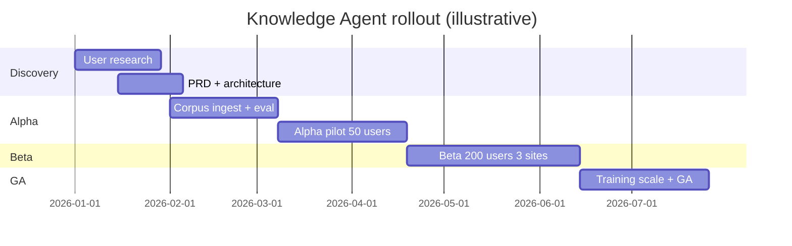
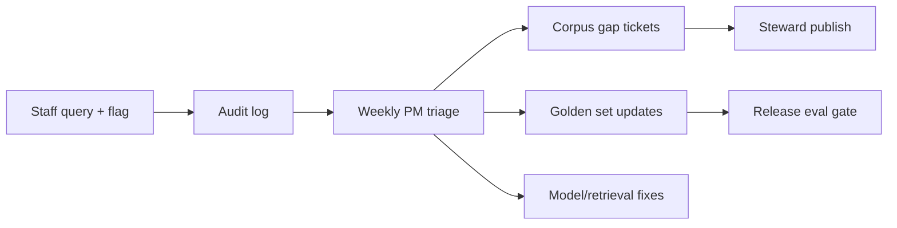

# Rollout Plan — Knowledge Agent

**Project:** Knowledge Agent: Human-in-the-Loop Retrieval System for High-Stakes Decision Support  
**Version:** 1.0 · **Anonymized portfolio design** · **Status:** Proposed plan (not executed)

---

## Rollout overview

---

## Alpha plan

### Objectives

- Validate **grounding, safety, and escalation** in live staff workflow
- Identify corpus gaps via zero-match queries
- Refine confidence thresholds with real usage

### Cohort

| Parameter | Value |
| --- | --- |
| Users | 50 frontline staff |
| Sites | 1 regional office |
| Duration | 6 weeks |
| Corpus | 3 source families (~120 approved docs) |

### Entry criteria

- [ ] Golden set ≥150 queries; alpha eval gates passed offline
- [ ] Red-team 100% pass (OOS/clinical)
- [ ] SSO + audit logging verified
- [ ] Supervisor escalation queue staffed
- [ ] Training completed by 100% of alpha users

### Support model

- Office hours: 3x/week with PM + SME
- `#knowledge-agent-pilot` channel (internal)
- Same-day triage for Sev-1 (safety) flags

### Exit criteria → Beta

See [`06-evaluations/evaluation-framework.md`](../06-evaluations/evaluation-framework.md) Alpha gate.

---

## Beta plan

### Objectives

- Prove **adoption** and **supervisor load reduction** trend
- Expand corpus (+training materials)
- Harden ops: steward SLAs, dashboard, flag → fix loop

### Cohort

| Parameter | Value |
| --- | --- |
| Users | 200 |
| Sites | 3 |
| Duration | 8 weeks |

### Beta additions

- Staff flag → steward ticket integration
- Supervisor QA dashboard v1
- Monthly golden set refresh from anonymized prod queries

### Exit criteria → GA

- TLSR ≥70% for 4 consecutive weeks
- Grounding ≥92%; hallucination <3%
- WAU ≥60%; helpfulness ≥4.0/5
- Zero Sev-1 safety incidents
- Compliance + works council sign-off (if applicable)

---

## GA plan

### Launch scope

- All frontline staff in pilot programs (phased by region)
- Full Tier A/B corpus (~300 docs initial)
- Embedded in standard onboarding

### GA hardening

- 24/5 support rotation documented
- Runbook: index failure, model outage, escalation backlog
- Regression eval on every corpus publish
- Executive dashboard automated weekly email

### Post-GA (Phase 2 candidates — not committed)

- Voice input for phone workers
- Additional program corpora
- Suggested lookup prompts in case system (read-only)

---

## Training plan

### Modules

| Module | Audience | Duration | Format |
| --- | --- | --- | --- |
| **Trust & boundaries** | All staff | 30 min | Live + job aid |
| **Hands-on queries** | Frontline | 45 min | Lab with golden examples |
| **Escalation & QA** | Supervisors | 30 min | Workshop |
| **Corpus stewardship** | Stewards | 45 min | Admin walkthrough |

### Core training messages

1. **The agent finds; you decide.**
2. **Always check citations before sharing with clients.**
3. **Low confidence = escalate, not guess.**
4. **Never paste client PII into queries.**
5. **Flag wrong or outdated answers—helps everyone.**

### Job aid (1-pager)

- When to use / when not to use
- How to read confidence bands
- Escalation button path
- FAQ: "It didn't know" is OK

---

## Change management

| Stakeholder | Concern | Mitigation |
| --- | --- | --- |
| Frontline staff | "AI will replace us" | Human-in-the-loop messaging; union briefing |
| Supervisors | More work / liability | Escalation reduces repeat interrupts; audit trail |
| Compliance | Logging + harm | OOS blocks; eval gates; legal review |
| Content stewards | Extra workload | Ingestion SLAs; gap-driven prioritization |
| Leadership | ROI | TLSR + time savings + KB utilization |

**Champions:** 2 supervisors + 2 veteran advocates per site as peer trainers.

---

## Feedback loops

| Signal | Action owner | SLA |
| --- | --- | --- |
| Thumbs down | PM + SME | Review ≤3 days |
| Zero-match query | Steward | Corpus gap ticket ≤5 days |
| Stale citation flag | Steward | Review ≤5 days |
| Safety flag | PM + Compliance | Same day |

---

## Launch risks

| Risk | Mitigation |
| --- | --- |
| Trust collapse from one bad answer | Alpha size limit; Medium confidence UX; rapid flag response |
| Corpus not ready | MVP scope only 3 families; expansion gated |
| Supervisor queue overload | Monitor escalation rate; tune confidence threshold |
| Low adoption | Champions; embed in workflow; measure TLSR not vanity logins |
| Regulatory objection | Staff-only; no client data in model training; auditability |

---

## Go / no-go criteria (GA decision meeting)

**Go if all true:**

- [ ] Beta exit criteria met for 4 weeks
- [ ] Training materials finalized + L&D sign-off
- [ ] Steward SLAs staffed
- [ ] Support runbook tested (game day)
- [ ] Executive sponsor written approval

**No-go triggers:**

- Any unresolved Sev-1 safety incident
- Grounding <90% on latest golden run
- Compliance blockers open

**Decision owners:** Executive sponsor + Product + Compliance (fictional governance body).
