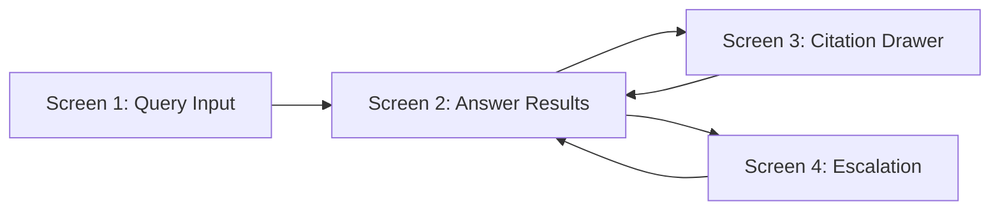

# Demo UI Specification — Knowledge Agent

**Project:** Knowledge Agent: Human-in-the-Loop Retrieval System for High-Stakes Decision Support  
**Version:** 1.0 · **Platform:** Staff web sidebar (desktop-first) · **Anonymized portfolio spec**

---

## Design principles

1. **Speed under stress** — minimal clicks from question to cited answer  
2. **Trust visible** — citations, freshness, confidence always on-screen  
3. **Escalation is first-class** — not buried in overflow menu  
4. **No client-facing mode** — staff auth required; persistent disclaimer  

---

## Information architecture



---

## Screen 1 — Query Input

### Purpose

Capture staff natural-language question quickly; prevent OOS/PII mistakes before retrieval runs.

### Layout (wireframe description)

```
┌─────────────────────────────────────┐
│ Knowledge Agent          [? Help] │
├─────────────────────────────────────┤
│ ⚠ Do not paste client names or IDs  │
├─────────────────────────────────────┤
│ ┌─────────────────────────────────┐ │
│ │ Ask about approved policies,    │ │
│ │ referrals, eligibility docs…    │ │
│ │                                 │ │
│ └─────────────────────────────────┘ │
│ [Example prompts ▾]                   │
│                                     │
│ [ Submit query ]                    │
├─────────────────────────────────────┤
│ Recent queries (self, 7 days)       │
└─────────────────────────────────────┘
```

### User actions

| Action | Behavior |
| --- | --- |
| Type query | Free text; max 500 chars |
| Submit | Enter or button; triggers retrieval |
| Select example prompt | Pre-fills editable template |
| Open help | Job aid modal: when to use / not use |
| View recent | Re-run prior query (read-only log) |

### Key UI components

| Component | Spec |
| --- | --- |
| Query textarea | Auto-focus; 3 rows expandable |
| PII warning banner | Persistent; links to policy |
| Example prompt chips | "Housing Region B 18–24", "Food pantry schedule", "DV shelter referral" |
| Submit button | Disabled if empty; loading state on submit |
| Auth badge | Role + site (e.g., Frontline · Region B) |

### Success criteria

- Median time to submit < 15s for returning users  
- ≥95% queries submitted without validation error  
- PII warning acknowledged once per session (checkbox optional)

### Edge cases

| Edge case | UX |
| --- | --- |
| Empty submit | Inline validation |
| PII pattern detected (SSN, email) | Block submit; "Remove client identifiers" |
| Offline / timeout | Retry + "Copy query for supervisor" |
| Query >500 chars | Truncate with warning |

---

## Screen 2 — Answer / Results

### Purpose

Present cited summary staff can scan in <30 seconds during a live interaction.

### Layout

```
┌─────────────────────────────────────┐
│ ← Back          Confidence: MEDIUM 🟡 │
├─────────────────────────────────────┤
│ SUMMARY                             │
│ • Program Horizon — ages 18–24 [1]  │
│ • Crisis shelter via Housing Line[2]│
│ • Verify bed availability before…   │
├─────────────────────────────────────┤
│ CITATIONS                           │
│ [1] Referral Directory §2.4    [→]  │
│ [2] Crisis Intake SOP §6.1     [→]  │
├─────────────────────────────────────┤
│ [ Open all sources ]                │
│ [ Escalate to supervisor ]          │
│ [ 👍 Helpful ]  [ 👎 Not helpful ]  │
├─────────────────────────────────────┤
│ You decide what to share with caller│
└─────────────────────────────────────┘
```

### User actions

| Action | Behavior |
| --- | --- |
| Read summary | Scrollable; citations inline as superscripts |
| Tap citation | Opens Screen 3 drawer |
| Open all sources | Multi-tab source viewer |
| Escalate | Opens Screen 4 pre-filled |
| Thumbs up/down | Logs feedback; optional reason |
| Copy summary | Clipboard with citations appended |

### Key UI components

| Component | Spec |
| --- | --- |
| Confidence badge | High (green) / Medium (amber) / Low (red) |
| Freshness chips | Per citation: "Reviewed Apr 2026" |
| Stale warning | Banner if any citation >12 months |
| Conflict banner | If sources disagree — links to both |
| Loading skeleton | Shows retrieval progress ("Searching approved sources…") |
| Abstain state | "No approved match" + escalation CTA |

### Success criteria

- p95 time-to-first-content <3s  
- ≥50% sessions with ≥1 citation opened (beta target)  
- Thumbs feedback on ≥30% of sessions

### Edge cases

| Edge case | UX |
| --- | --- |
| Low confidence | Red badge; escalation recommended prominently |
| OOS/clinical query | Block summary; crisis protocol card instead |
| Zero results | Abstain message; no fabricated answer |
| Medium confidence | Amber + checkbox: "I verified before use" (optional) |

---

## Screen 3 — Citation / Source Drawer

### Purpose

Let staff verify exact language, version, and section before client-facing use.

### Layout (slide-over drawer)

```
┌─────────────────────────────────────┐
│ ✕ Close                             │
│ Referral Directory — Region B       │
│ v2026.03 · Reviewed 2026-04-15     │
├─────────────────────────────────────┤
│ §2.4 Young Adult Housing            │
│ ┌─────────────────────────────────┐ │
│ │ Program Horizon serves adults   │ │
│ │ 18–24 with Region B residency…  │ │
│ │ (highlighted matched chunk)     │ │
│ └─────────────────────────────────┘ │
│ [ Open full document ]              │
│ [ Report outdated ]                 │
└─────────────────────────────────────┘
```

### User actions

| Action | Behavior |
| --- | --- |
| Read chunk | Highlighted passage match |
| Open full document | Org doc portal in new tab |
| Report outdated | Creates steward ticket with query + chunk ref |
| Navigate prev/next | Move across citations [1][2][3] |

### Key UI components

| Component | Spec |
| --- | --- |
| Metadata header | Title, version, last_reviewed, authority tier |
| Chunk highlight | Yellow highlight on retrieved span |
| Section breadcrumb | e.g., §2.4 Young Adult Housing |
| Report outdated | Pre-filled ticket; sends to steward queue |

### Success criteria

- Staff can reach full doc in ≤2 clicks from summary  
- Report outdated creates ticket in <10s user time

### Edge cases

| Edge case | UX |
| --- | --- |
| Document retired since index | "This version was retired on [date]. View successor." |
| Deep link broken | Error + supervisor escalation link |
| Chunk out of context | "View full section" expands surrounding paragraphs |

---

## Screen 4 — Escalation Workflow

### Purpose

Route ambiguous, low-confidence, or out-of-scope queries to a human with full context—no dead ends.

### Layout

```
┌─────────────────────────────────────┐
│ Escalate to supervisor              │
├─────────────────────────────────────┤
│ Reason: ○ Low confidence            │
│         ○ Conflicting sources         │
│         ○ Out of scope                │
│         ○ Other                     │
├─────────────────────────────────────┤
│ Your question (editable)            │
│ ┌─────────────────────────────────┐ │
│ │ [pre-filled from query]         │ │
│ └─────────────────────────────────┘ │
│ Notes for supervisor (optional)     │
├─────────────────────────────────────┤
│ Attached context (read-only):       │
│ • Top 3 retrieved chunks            │
│ • Agent draft (if any)              │
│ • Confidence: 0.42                  │
├─────────────────────────────────────┤
│ [ Submit escalation ]  [ Cancel ]   │
└─────────────────────────────────────┘
```

### User actions

| Action | Behavior |
| --- | --- |
| Select reason | Required radio |
| Edit question | Pre-filled; editable |
| Add notes | Optional free text |
| Submit | Creates supervisor queue ticket |
| Cancel | Returns to results or input |

### Key UI components

| Component | Spec |
| --- | --- |
| Reason codes | LOW_CONFIDENCE, CONFLICT, OOS, STALE, NO_MATCH, OTHER |
| Context bundle | Auto-attached chunks + scores (supervisor-only view) |
| SLA hint | "Typical response: 15 min during shift" |
| Confirmation | Ticket ID displayed; copy link |

### Success criteria

- Escalation submit <20s median  
- ≥85% supervisor tickets acknowledged within SLA (beta)  
- Zero escalations lost (audit log = ticket ID)

### Edge cases

| Edge case | UX |
| --- | --- |
| OOS auto-escalation | Reason pre-selected; crisis resources shown |
| After-hours | Queue + on-call routing message |
| Duplicate escalation | Warn if same query escalated <10 min ago |
| Supervisor resolves | Optional notify staff via in-app ping (Phase 2) |

---

## Cross-screen requirements

| Requirement | Spec |
| --- | --- |
| Accessibility | WCAG 2.1 AA; keyboard nav; screen reader labels on confidence |
| Session timeout | 15 min; re-auth; no query text in URL params |
| Audit | Every screen transition logged with query_id |
| Branding | Neutral internal tool; no "AI avatar" persona |

---

## Prototype recommendation (portfolio next step)

| Fidelity | Tool | Deliverable |
| --- | --- | --- |
| Low | Figma / HTML | 4 linked screens for demo video |
| Medium | Retool / Streamlit mock | Fake retrieval with static JSON |
| High | Staging API | Golden-set replay mode for eval demos |

---

## Related artifacts

- Walkthrough: [`end-to-end-walkthrough.md`](end-to-end-walkthrough.md)
- Demo script: [`demo-script.md`](demo-script.md)
- PRD: [`../04-prd/knowledge-agent-prd.md`](../04-prd/knowledge-agent-prd.md)
