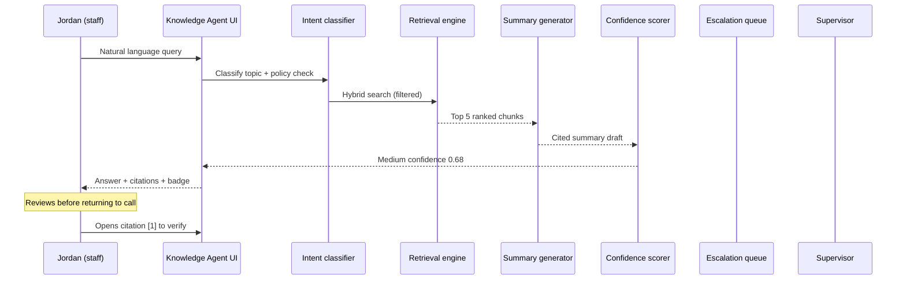

# End-to-End Walkthrough — Knowledge Agent

**Project:** Knowledge Agent: Human-in-the-Loop Retrieval System for High-Stakes Decision Support  
**Version:** 1.0 · **Scenario:** G-001 (housing instability) · **Data:** Fictional sample trace

---

## Scenario context

**User:** Jordan, frontline advocate (authenticated staff)  
**Setting:** Live phone call; caller on brief hold  
**Constraint:** Must use approved sources only; human decides all client-facing statements

---

## Walkthrough overview

---

## Step 1 — User query

**Staff input:**

> 19-year-old caller in Region B says they've been couch surfing for two weeks and want to know transitional housing options. Also mentioned stress but no crisis plan. What approved programs should I review?

**Audit log (mock):**

| Field | Value |
| --- | --- |
| `query_id` | LIVE-2026-03-18-00421 |
| `user_role` | frontline_advocate |
| `site` | region_b |
| `timestamp` | 2026-03-18T14:32:08Z |

---

## Step 2 — Intent detection

| Signal | Output |
| --- | --- |
| Primary topic | `housing_instability` |
| Secondary topic | `behavioral_health` (non-crisis mention) |
| Region extracted | `region_b` |
| Age band | `18-24` |
| Policy check | ✅ In scope (resource lookup) |
| Clinical check | ✅ No crisis indicators requiring block |
| Query rewrite | "Region B transitional housing programs age 18-24 young adult" |

**Routing decision:** Search partitions `referral_directory`, `crisis_intake_sop`, `youth_services_sop` with role filter `frontline`.

---

## Step 3 — Retrieved documents (pre-rank)

| Rank | Chunk ID | Document | Section | Relevance (raw) |
| --- | --- | --- | --- | --- |
| 1 | chk_91bc | Referral Directory — Region B v2026.03 | §2.4 Young Adult Housing | 0.89 |
| 2 | chk_44ad | Crisis Intake SOP v5.2 | §6.1 Shelter Referral | 0.84 |
| 3 | chk_44ae | Crisis Intake SOP v5.2 | §4.2 Non-crisis BH mention | 0.61 |
| 4 | chk_77ff | Youth Services SOP v3.1 | §1.2 Age definitions | 0.58 |
| 5 | chk_12cd | Behavioral Health One-Pager | Partnership Care | 0.52 |

Chunks 3–5 deprioritized for summary (secondary to housing ask).

---

## Step 4 — Ranked sources (post-rerank)

| Final rank | Document | Why ranked |
| --- | --- | --- |
| **1** | Referral Directory §2.4 | Direct Program Horizon match; Tier A authority |
| **2** | Crisis Intake SOP §6.1 | Distinguishes crisis shelter vs transitional |
| **3** | Youth Services SOP §1.2 | Confirms 18–24 young adult definition |

**Conflict check:** None  
**Freshness check:** All reviewed within 6 months ✅

---

## Step 5 — Generated answer (staff-facing)

**Summary**

For callers age **18–24** in **Region B** experiencing housing instability, review these approved pathways:

1. **Program Horizon** — transitional housing with case management. Eligibility includes Region B residency and age 18–24 [1].
2. **Crisis shelter referral** — if caller needs immediate overnight placement, use the Regional Housing Line per crisis intake protocol [2]. Bed availability is **not** confirmed in static documentation.
3. If caller wants **non-crisis behavioral health support**, Partnership Care referrals are documented separately [3] — not required for housing-only intake.

Staff must complete standard intake before stating eligibility. This summary does not guarantee placement.

**Staff disclaimer (UI footer):** *You are accountable for what you share with the caller. Verify citations before use.*

---

## Step 6 — Citations

| # | Document | Version | Last reviewed | Section | Link |
| --- | --- | --- | --- | --- | --- |
| [1] | Referral Directory — Region B | 2026.03 | 2026-04-15 | §2.4 Young Adult Housing | `[Open source]` |
| [2] | Crisis Intake SOP | 5.2 | 2026-03-01 | §6.1 Shelter Referral | `[Open source]` |
| [3] | Behavioral Health One-Pager | 2026.01 | 2026-02-20 | Non-crisis referrals | `[Open source]` |

**Citation coverage:** 8/8 factual sentences mapped (100%)

---

## Step 7 — Confidence score

| Component | Score | Weight | Contribution |
| --- | --- | --- | --- |
| Top chunk relevance | 0.89 | 0.40 | 0.356 |
| Citation coverage | 1.00 | 0.25 | 0.250 |
| Source authority (avg) | 0.95 | 0.20 | 0.190 |
| Freshness factor | 1.00 | 0.10 | 0.100 |
| Conflict penalty | 0.00 | −0.15 | 0.000 |
| **Composite** | **0.68** | — | **Medium** |

**UI treatment:** Amber badge — *"Verify bed availability before client-facing statements."*

**Escalation auto-trigger:** No (above 0.50 floor; no conflict)

---

## Step 8 — Escalation decision

| Check | Result |
| --- | --- |
| Confidence < 0.50? | No |
| Conflict detected? | No |
| OOS/clinical? | No |
| Corpus gap? | No |
| **Decision** | **Show answer; escalation optional** |

Jordan does **not** escalate — opens citation [1] to confirm Horizon income requirements before returning to call.

---

## Step 9 — Human review (post-session)

| Action | Actor | Outcome |
| --- | --- | --- |
| Opens citation [1] | Jordan | Confirms §2.4 matches verbal summary |
| Flags "Helpful" | Jordan | Logged for quality dashboard |
| QA sample (weekly) | Supervisor Riley | Rubric 4.5/5 — relevant, grounded, appropriate Medium badge |

**No supervisor ticket created.** Escalation queue unchanged.

---

## Alternate path — same query with conflict (G-049 style)

If Referral Directory and Program One-Pager disagree on income limits:

| Step | Behavior |
| --- | --- |
| Conflict detector | Flags mismatch |
| Confidence | Downgraded to 0.42 (Low) |
| UI | Side-by-side citations with effective dates |
| Escalation | **Auto-recommended** — ticket pre-filled for supervisor |
| Agent | Does **not** merge into single eligibility claim |

---

## What this walkthrough demonstrates

| AI PM competency | Evidence in trace |
| --- | --- |
| Agent design | Intent → retrieve → cite → score → decide |
| Trust & safety | No guarantees; OOS checks; Medium badge |
| Evaluation | Trace maps to golden row G-001 |
| Human-in-the-loop | Staff verifies before client-facing use |
| Metrics | Confidence decomposition auditable |

---

## Related artifacts

- Golden row: `G-001` in [`../06-evaluations/golden-dataset.csv`](../06-evaluations/golden-dataset.csv)
- UI screens: [`demo-ui-spec.md`](demo-ui-spec.md)
- Architecture: [`../05-agent-design/agent-architecture.md`](../05-agent-design/agent-architecture.md)

**Disclaimer:** Trace IDs, timestamps, and scores are **fictional illustrations**.
