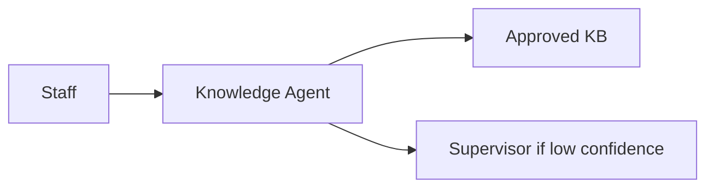

# Executive Two-Pager — Knowledge Agent

**Project:** Knowledge Agent: Human-in-the-Loop Retrieval System for High-Stakes Decision Support  
**Prepared for:** Executive steering committee (fictional) · **Anonymized portfolio artifact**

> Illustrates executive communication format. Not a real investment request or deployment proposal.

---

## Executive summary

We propose a **6-week alpha pilot** of **Knowledge Agent**—an internal, staff-facing AI assistant that retrieves and summarizes **approved** policies and referral resources with **mandatory citations** and **explicit escalation** when confidence is low.

**Investment ask:** Pilot engineering + content stewardship capacity for one region (50 users).  
**Decision requested:** Approve alpha charter and compliance logging policy (see bottom).

---

## Customer problem

Frontline staff spend **3–12 minutes per non-routine lookup** searching across wikis, PDFs, spreadsheets, and supervisor memory—while clients wait. Outcomes:

- Inconsistent resource information  
- Higher supervisor interrupt load  
- Slower new-hire ramp  
- Underutilized KB investments  

**This is a retrieval and trust problem—not missing content.**

---

## Proposed solution

**Knowledge Agent** = governed retrieval layer + citation-required summaries + confidence scoring + human escalation.

| Does | Does not |
| --- | --- |
| Find approved information fast | Replace staff judgment |
| Cite sources with version dates | Provide clinical guidance |
| Escalate when uncertain | Contact clients directly |
| Log queries for QA | Browse unapproved web content |

---

## Why now

- Staffing pressure ↑; lookup time ↓ available  
- RAG technology mature enough for grounded pilots  
- Leadership mandate: AI with **auditability**, not automation theater  
- Content team already maintains SOPs—need better **activation**

---

## MVP scope (alpha)

| In | Out |
| --- | --- |
| 50 staff, 1 site | Client-facing bot |
| 3 source families (~120 docs) | CRM integration |
| Web sidebar + escalation queue | Voice / mobile |
| Training + job aid | Clinical triage |

**Duration:** 6 weeks · **Cost:** [Fictional internal budget placeholder—engineering 2 FTE, PM 0.5, steward 0.25]

---

## Success metrics (alpha → beta)

| Metric | Alpha target | Beta target |
| --- | --- | --- |
| Trusted Lookup Success Rate (TLSR) | Baseline + direction | ≥70% |
| Grounding accuracy (golden set) | ≥88% | ≥92% |
| Hallucination rate | <5% | <3% |
| Median time-to-answer | −30% directional | −40% |
| Weekly active usage | ≥50% cohort | ≥60% |
| Safety incidents (Sev-1) | 0 | 0 |

---

## Risks and mitigations

| Risk | Mitigation |
| --- | --- |
| Wrong answer erodes trust | Citation enforcement; eval gates; abstain path |
| Stale policies indexed | Freshness metadata + steward SLAs |
| Staff over-rely without verification | Training; Medium-confidence UX; QA sampling |
| Scope creep into clinical AI | OOS classifier + red-team + compliance review |
| Low adoption | Supervisors champions; embed in workflow |

---

## Decision requested

1. **Approve alpha pilot** — 50 users, 1 region, 6 weeks, charter as defined.  
2. **Approve audit logging policy** — 90-day query retention; staff-only access; no client PII in queries (training-enforced).  
3. **Assign executive sponsor** — escalation path for safety incidents and corpus disputes.

**If deferred:** Continue baseline time-motion study only; repeat lookup pain in next quarter.

---

**Contact:** Product lead (portfolio case study — anonymized)  
**Appendix:** Full PRD, architecture, eval framework available in repository.
