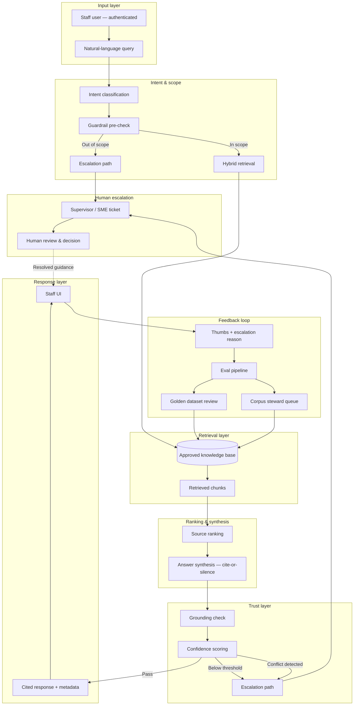
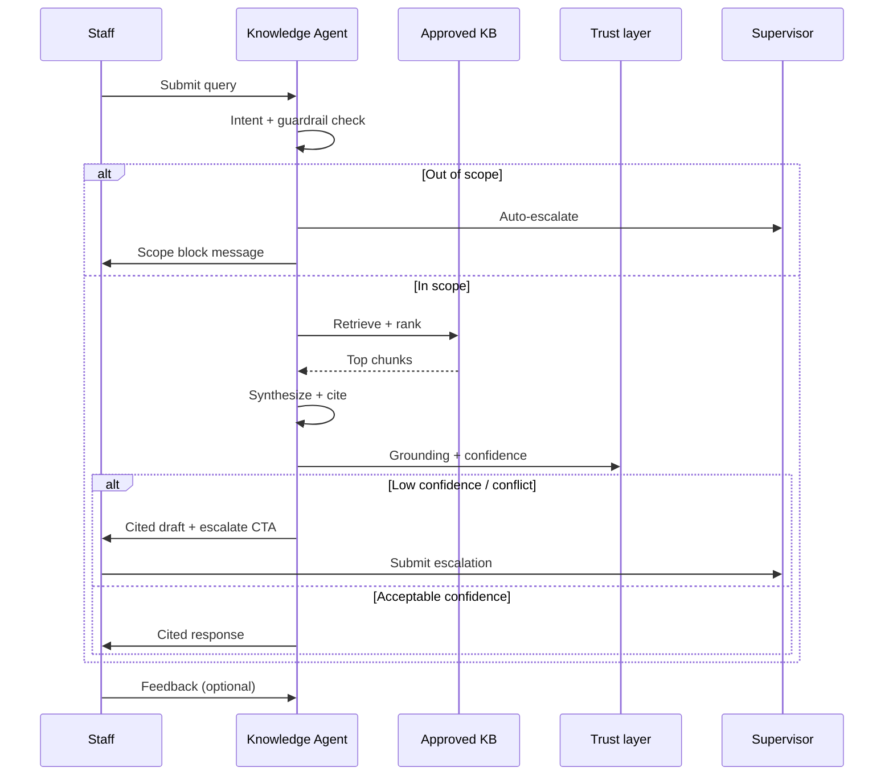

# Architecture Diagram — Knowledge Agent

**Project:** Knowledge Agent: Human-in-the-Loop Retrieval System for High-Stakes Decision Support  
**Version:** 1.0 · **Purpose:** Portfolio visual artifact (design specification)

> All components and flows below describe a **portfolio system design**. This is not a deployed production architecture.

---

## System overview

Knowledge Agent is a **human-in-the-loop retrieval system**. Staff submit questions; the system retrieves from an approved corpus, synthesizes cited answers, scores confidence, and routes to escalation when appropriate. Humans retain all decision authority.

---

## End-to-end architecture (Mermaid)

---

## Component descriptions

| Component | Responsibility | Portfolio note |
| --- | --- | --- |
| **Intent classification** | Route query to domain (housing, benefits, OOS clinical) | Blocks or flags high-risk intents early |
| **Guardrail pre-check** | PII warning, OOS clinical block, scope reminder | Fail-closed on prohibited query types |
| **Hybrid retrieval** | Semantic + keyword search over approved index only | No open-web retrieval |
| **Source ranking** | Relevance, freshness, authority tier, geography match | Deprioritize stale or retired docs |
| **Answer synthesis** | Concise summary with inline citations | Cite-or-silence; no uncited claims |
| **Grounding check** | Verify each sentence maps to retrieved chunk | Automated + SME spot check in evals |
| **Confidence scoring** | Aggregate match strength, source agreement, freshness | Threshold triggers escalation UX |
| **Escalation path** | Ticket with query, chunks, draft, reason code | Human-in-the-loop by design |
| **Feedback loop** | Staff feedback → eval dataset → corpus updates | Closes the improvement cycle |

---

## Sequence view (single query)

---

## Design principles (architecture-level)

1. **Approved sources only** — retrieval boundary is the trust boundary  
2. **Cite-or-silence** — no uncited factual output  
3. **Escalate-over-guess** — low confidence is a product state, not a failure  
4. **Eval-driven iteration** — feedback loop feeds golden set and corpus stewardship  
5. **Human decision authority** — agent assists lookup; staff decide what to share  

---

## Export notes

| Format | Use |
| --- | --- |
| Mermaid (above) | GitHub README, Notion, portfolio site |
| PNG export | LinkedIn carousel, PDF appendix — render via Mermaid Live Editor |
| FigJam | Optional: duplicate as editable diagram for interviews |

---

## Related artifacts

- Agent design detail: [`../05-agent-design/agent-architecture.md`](../05-agent-design/agent-architecture.md)
- End-to-end walkthrough: [`../09-demo/end-to-end-walkthrough.md`](../09-demo/end-to-end-walkthrough.md)
- Trust model: [`../CASE-STUDY.md`](../CASE-STUDY.md)
