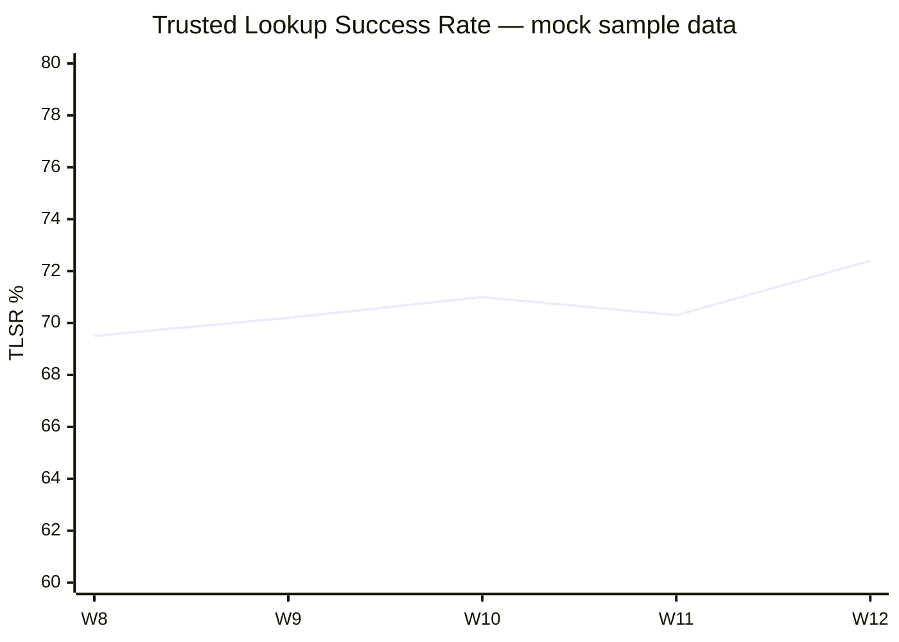

# Dashboard Screenshot Spec — Knowledge Agent

**Project:** Knowledge Agent: Human-in-the-Loop Retrieval System for High-Stakes Decision Support  
**Version:** 1.0 · **Purpose:** Portfolio-ready metrics dashboard mockup specification

> **All metrics below are mock / sample data.** They do not represent production deployment results or measured real-world impact.

---

## Screenshot purpose

Provide a single **executive-grade dashboard image** for GitHub README, LinkedIn, and interview decks. The dashboard shows that Knowledge Agent is governed by **trust metrics**, not vanity query volume.

**Recommended export:** 1440×900 PNG · filename: `knowledge-agent-dashboard-mock.png`

---

## Layout wireframe (ASCII)

```
┌─────────────────────────────────────────────────────────────────────────────┐
│ Knowledge Agent — Pilot Dashboard          Week 12 · Sample data · Region B │
├──────────────┬──────────────┬──────────────┬──────────────┬──────────────────┤
│ TLSR         │ Grounding    │ Hallucination│ Escalation   │ Safety           │
│ 72.4% ▲2.1pp │ 91.8%        │ 2.6%         │ accuracy 89% │ incidents: 0     │
│ (mock)       │ (mock)       │ (mock)       │ (mock)       │ (mock)           │
├──────────────┴──────────────┴──────────────┴──────────────┴──────────────────┤
│  TIME SAVED (mock)              │  SEARCH SUCCESS BREAKDOWN (mock)            │
│  ████████░░ 5.6 min / lookup    │  Helpful cited: 58%  Escalated: 16%       │
│  vs 6.8 min baseline            │  Failed/abandoned: 14%                    │
├─────────────────────────────────┼───────────────────────────────────────────┤
│  LATENCY p95 (mock)             │  USER SATISFACTION (mock)                 │
│  ▁▂▃▄▅ 7.8s  target <8s         │  ★★★★☆ 4.1 / 5.0                          │
├─────────────────────────────────┼───────────────────────────────────────────┤
│  STALE SOURCE RATE (mock)       │  TOP CORPUS GAP (mock)                    │
│  Tier A: 94% current            │  benefits_eligibility — 8 steward tickets   │
│  Flagged answers: 9%            │                                           │
└─────────────────────────────────┴───────────────────────────────────────────┘
│ Footer: Sample evaluation data · Not production metrics · Portfolio mock    │
└─────────────────────────────────────────────────────────────────────────────┘
```

---

## Mock metrics table (portfolio screenshot)

| Metric | Mock value | Target (GA) | Label |
| --- | --- | --- | --- |
| **Search success rate (TLSR)** | 72.4% | ≥75% | Sample |
| **Grounding pass rate** | 91.8% | ≥94% | Sample |
| **Hallucination rate** | 2.6% | <2% | Sample |
| **Escalation accuracy** | 89% | ≥90% | Sample |
| **Median latency** | 4.2s | — | Sample |
| **p95 latency** | 7.8s | <8s | Sample |
| **Time saved per lookup** | 5.6 min | ≥4.0 min | Sample (vs mock baseline 6.8 min) |
| **User satisfaction** | 4.1 / 5.0 | ≥4.0 | Sample |
| **Stale source rate (Tier A)** | 6% stale | ≤5% | Sample |
| **Safety incidents** | 0 | 0 | Sample |

---

## Visual design spec

| Element | Spec |
| --- | --- |
| Background | `#F8FAFC` |
| Card surface | `#FFFFFF`, 1px border `#E2E8F0`, 8px radius |
| Primary metric | 28px semibold `#0F172A` |
| Trend delta | Green `#16A34A` for positive; label "▲2.1pp (mock)" |
| Warning metrics | Amber `#D97706` when below target |
| Footer banner | `#FEF3C7` — **"Sample data · Portfolio mock · Not production metrics"** |
| Font | Inter or system sans |

---

## Chart specifications (mock data)

### Search success rate trend (8 weeks)

| Week | TLSR (mock) |
| --- | --- |
| W5 | 64.2% |
| W6 | 66.8% |
| W7 | 68.1% |
| W8 | 69.5% |
| W9 | 70.2% |
| W10 | 71.0% |
| W11 | 70.3% |
| W12 | 72.4% |

### Grounding vs hallucination (mock)

| Week | Grounding pass | Hallucination rate |
| --- | --- | --- |
| W10 | 90.1% | 3.2% |
| W11 | 91.2% | 2.9% |
| W12 | 91.8% | 2.6% |

---

## Mermaid chart (for GitHub rendering)



---

## Screenshot caption (for LinkedIn / README)

> **Knowledge Agent pilot dashboard (mock data).** Sample metrics from a portfolio evaluation design: TLSR, grounding pass rate, hallucination rate, escalation accuracy, latency, time saved, staff satisfaction, and corpus freshness. Not production results.

---

## How to produce the PNG

1. Build in Figma using wireframe above, or  
2. Render Mermaid charts + table in Notion → export, or  
3. Use [`../07-metrics/dashboard-mockup.md`](../07-metrics/dashboard-mockup.md) as content source  

Save to: `11-visual-artifacts/exports/knowledge-agent-dashboard-mock.png` (optional folder at publish time)

---

## Related artifacts

- KPI definitions: [`../07-metrics/kpi-framework.md`](../07-metrics/kpi-framework.md)
- Full dashboard spec: [`../07-metrics/dashboard-mockup.md`](../07-metrics/dashboard-mockup.md)
- Eval scorecard: [`../06-evaluations/evaluation-scorecard.md`](../06-evaluations/evaluation-scorecard.md)
