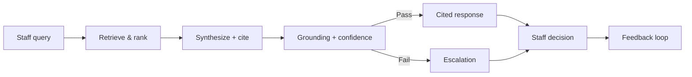

# Case Study — Knowledge Agent

**Knowledge Agent: Human-in-the-Loop Retrieval System for High-Stakes Decision Support**

*Flagship anonymized case study · [Mikin Macwan LLC](ABOUT-MIKIN-MACWAN-LLC.md) · 2026*

> **5-minute read.** All scenarios, organizations, and metrics are fictional or sample data. [Full disclaimer →](DISCLAIMER.md)

---

## Context

Knowledge Agent is a **flagship anonymized case study from my AI consulting practice, Mikin Macwan LLC**. It shows how I lead 0→1 human-in-the-loop AI product work—from opportunity framing through evaluation gates and rollout planning—with artifacts recruiters can review directly.

**Try the interactive demo:** [mikinmacwan-pm.github.io/knowledge-agent](https://mikinmacwan-pm.github.io/knowledge-agent/)

---

## One-line summary

A human-in-the-loop retrieval system that helps frontline staff find **approved, cited information** during high-stakes interactions—escalating when it should not guess.

---

## Problem

Frontline staff in crisis-adjacent support environments must answer complex questions **in real time**—often while someone is on the phone or in the room. Approved information exists across policy PDFs, referral directories, training decks, and tribal knowledge. Staff search 4–6 systems under time pressure; supervisors field repeat questions; new hires shadow for months; outdated documents circulate informally.

**The bottleneck is retrieval, trust, and workflow—not missing content.**

---

## Users

| Persona | Need |
| --- | --- |
| **Frontline staff** | Fast, cited answers during live interactions |
| **Supervisors / SMEs** | Fewer repeat interrupts; clear escalation context |
| **Knowledge stewards** | Feedback on stale or conflicting sources |
| **Product / leadership** | Trust metrics, not vanity adoption |

**Not a user:** clients or callers. Knowledge Agent is staff-facing only.

---

## Why AI / why now

| Factor | Implication |
| --- | --- |
| Mature RAG patterns | Retrieval + citation feasible without custom model training |
| Staff AI literacy rising | Users expect search-like UX with source transparency |
| Accountability requirements | High-stakes settings reject black-box chatbots |
| KB investment already made | AI layer unlocks existing content—if governed |

AI is appropriate for **retrieval and synthesis over approved sources**—not for clinical judgment, eligibility determination, or safety planning.

---

## Solution

**Knowledge Agent** is a human-in-the-loop retrieval system:

1. Staff submit a natural-language question (no client PII)  
2. System retrieves from **approved, indexed sources only**  
3. Ranks sources; synthesizes a concise summary with **inline citations**  
4. Runs grounding check; assigns **confidence score**  
5. Returns cited answer **or** recommends escalation  
6. Staff decide what to share; supervisors resolve edge cases  

---

## Before / after workflow

| Step | Before (today) | After (target with Knowledge Agent) |
| --- | --- | --- |
| Receive question | Staff searches 4–6 systems | Staff queries Knowledge Agent |
| Find policy | Manual PDF/wiki hunt (~3–12 min) | Cited summary in seconds (target) |
| Verify | Unclear version/freshness | Citation drawer shows date + owner |
| Uncertain | Interrupt supervisor ad hoc | Structured escalation with context |
| Document | Inconsistent | Logged query_id + citations (per SOP) |

*Time savings figures in portfolio docs are **targets/sample**, not measured results.*

---

## Product principles

1. **Humans decide.** The agent retrieves.  
2. **Cite or stay silent.** No uncited factual claims.  
3. **Escalate over guess.** Low confidence is a first-class state.  
4. **Eval before expansion.** Golden set gates corpus growth.  
5. **Staff-facing only.** No client-facing autonomous mode.  

---

## System design overview

| Layer | Function |
| --- | --- |
| Intent + guardrails | Classify query; block OOS clinical; PII warning |
| Retrieval | Hybrid search over approved corpus |
| Ranking | Relevance, freshness, geography, authority tier |
| Synthesis | Cited summary; abstain on zero match |
| Trust | Grounding check + confidence score |
| Escalation | Ticket with chunks, draft, reason code |
| Feedback | Thumbs, steward queue, golden set review |

Detail: [`11-visual-artifacts/architecture-diagram.md`](11-visual-artifacts/architecture-diagram.md)

---

## Evaluation strategy

| Component | Description |
| --- | --- |
| **Golden dataset** | 50 anonymized scenarios with expected sources, escalation, risk level |
| **Scorecard** | Precision, recall, grounding, hallucination, escalation accuracy, latency |
| **Release gates** | Alpha / beta / GA thresholds |
| **Sample eval run** | 8 scored examples; stratified pass/fail |
| **Red team** | Guarantee bait, OOS clinical, safety-plan generation, PII |

Detail: [`06-evaluations/evaluation-framework.md`](06-evaluations/evaluation-framework.md)

---

## Trust and safety model

| Risk | Mitigation |
| --- | --- |
| Hallucination | Cite-or-silence; grounding eval; SME spot checks |
| Clinical OOS | Hard block + auto-escalation |
| Stale sources | Freshness metadata; stale warnings in UI |
| Conflicting docs | Conflict banner; escalate; steward resolution |
| Over-reliance | Confidence badges; medium = verify before use |
| PII leakage | Input warning; no client identifiers in queries |
| Autonomous harm | No client-facing mode; no risk scoring; no safety-plan generation |

---

## Rollout plan (proposed)

| Phase | Scope | Gate |
| --- | --- | --- |
| **Alpha** | ~25 staff, 1 region, read-only | Golden subset pass; zero critical OOS failures |
| **Beta** | ~100 staff, 2 regions | Full golden run; TLSR ≥ target (sample harness) |
| **GA** | Org-wide | Freshness SLA; escalation SLA; exec sign-off |

Detail: [`08-launch-plan/rollout-plan.md`](08-launch-plan/rollout-plan.md)

---

## Metrics (sample / target)

| Metric | Sample (mock) | GA target |
| --- | --- | --- |
| TLSR | 72.4% | ≥75% |
| Grounding pass rate | 91.8% | ≥94% |
| Hallucination rate | 2.6% | <2% |
| Escalation accuracy | 89% | ≥90% |
| p95 latency | 7.8s | <8s |

Detail: [`07-metrics/kpi-framework.md`](07-metrics/kpi-framework.md)

---

## What I built (portfolio artifacts)

| Category | Artifacts |
| --- | --- |
| **Strategy** | Opportunity assessment, research plan, product strategy |
| **Product** | PRD, acceptance criteria, risks, non-goals |
| **Technical design** | Agent architecture, KB design, architecture diagram |
| **Corpus** | 30-document sample knowledge base with metadata |
| **Evaluations** | Golden CSV (50), scorecard, eval run sample |
| **Metrics** | KPI framework, dashboard mock, screenshot spec |
| **Experience** | End-to-end walkthrough, UI spec, Figma brief + screen copy |
| **GTM / ops** | Rollout plan, demo script, two-pager |
| **Recruiting** | Case study, interview story, recruiter pitch |

---

## Key artifacts (quick links)

| Read this | If you want |
| --- | --- |
| [`RECRUITER-PITCH.md`](RECRUITER-PITCH.md) | Elevator pitches |
| [`09-demo/end-to-end-walkthrough.md`](09-demo/end-to-end-walkthrough.md) | Full query trace |
| [`06-evaluations/evaluation-run-sample.md`](06-evaluations/evaluation-run-sample.md) | Scored eval examples |
| [`sample-knowledge-base/`](sample-knowledge-base/) | Retrieval corpus |
| [`11-visual-artifacts/architecture-diagram.md`](11-visual-artifacts/architecture-diagram.md) | System diagram |

---

## What I learned

- **Evals are the product** for trust-first AI—golden scenarios force clarity before build.  
- **Escalation UX is a feature**, not an error state—design it prominently.  
- **Corpus governance equals model quality**—30 governed docs beat 300 ungoverned ones.  
- **Non-goals build credibility**—saying no to client-facing and clinical AI signals maturity.  
- **Sample data must be labeled**—portfolio credibility requires intellectual honesty.  

---

## Next steps (if moving beyond portfolio)

1. Contextual user research with frontline staff and supervisors  
2. Staging prototype against sample corpus with golden-set replay  
3. High-fidelity Figma build from screen copy  
4. Weekly eval ops cadence with SME panel  
5. Steward sprint on known corpus conflicts before beta gate  

---

## Author

**Mikin Macwan** · Principal, Mikin Macwan LLC · 2026

→ [README (repo home)](README.md) · [About Mikin Macwan LLC](ABOUT-MIKIN-MACWAN-LLC.md) · [Disclaimer](DISCLAIMER.md) · [Interview story](INTERVIEW-STORY.md)

**© 2026 Mikin Macwan LLC**
