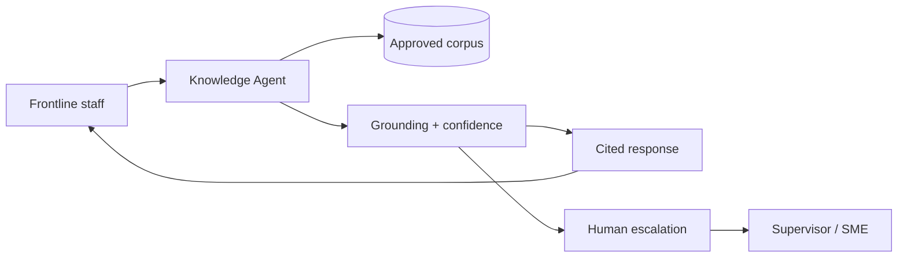

# Knowledge Agent: Human-in-the-Loop Retrieval System for High-Stakes Decision Support

**Flagship anonymized case study · [Mikin Macwan LLC](ABOUT-MIKIN-MACWAN-LLC.md)**

> **One-line summary:** A human-in-the-loop retrieval system that helps frontline staff find approved, cited information during high-stakes interactions—and escalates when it should not guess.

[](#disclaimer)
[](https://mikinmacwan-pm.github.io/knowledge-agent/)
[](LICENSE)

**Start here:** [`CASE-STUDY.md`](CASE-STUDY.md) (5 min) · [**Live demo**](https://mikinmacwan-pm.github.io/knowledge-agent/) · [`RECRUITER-PITCH.md`](RECRUITER-PITCH.md)

---

## About this project

Knowledge Agent is a **flagship anonymized case study from my AI consulting practice, Mikin Macwan LLC**. It documents how I lead 0→1 human-in-the-loop AI product work for high-stakes environments—strategy through evaluation gates, with product artifacts recruiters and hiring managers can actually review.

| | |
| --- | --- |
| **Led by** | Mikin Macwan · [Mikin Macwan LLC](ABOUT-MIKIN-MACWAN-LLC.md) |
| **What it is** | Trust-first retrieval system design + full PM artifact package |
| **What it is not** | A deployed product, production codebase, or claim of measured impact |
| **Core pattern** | Retrieve → cite → score confidence → escalate — humans decide |
| **Live demo** | [mikinmacwan-pm.github.io/knowledge-agent](https://mikinmacwan-pm.github.io/knowledge-agent/) |



---

## Recruiter path (10 minutes)

1. **[Live demo](https://mikinmacwan-pm.github.io/knowledge-agent/)** — interactive UI (2 min)  
2. **[`CASE-STUDY.md`](CASE-STUDY.md)** — executive summary (5 min)  
3. **[`06-evaluations/evaluation-run-sample.md`](06-evaluations/evaluation-run-sample.md)** — scored eval examples (3 min)  

→ Pitches: [`RECRUITER-PITCH.md`](RECRUITER-PITCH.md) · About: [`ABOUT-MIKIN-MACWAN-LLC.md`](ABOUT-MIKIN-MACWAN-LLC.md)

---

## Problem → solution

**Problem:** Staff search 4–6 systems under time pressure while a caller waits. Approved content exists—but retrieval, trust, and workflow break down.

**Solution:** Knowledge Agent is a **human-in-the-loop retrieval system** that returns cited summaries from approved sources, surfaces confidence and freshness, and routes to escalation when grounding is insufficient.

| Principle | Implementation |
| --- | --- |
| Humans decide | Staff-facing only; no client-facing bot |
| Cite or stay silent | Mandatory citations; no uncited claims |
| Escalate over guess | Low confidence is a product state |
| Eval before expansion | Golden dataset gates corpus growth |

→ Full narrative: [`CASE-STUDY.md`](CASE-STUDY.md)

---

## Repository map

```
knowledge-agent/
├── README.md                    ← You are here
├── CASE-STUDY.md                ← 5-minute executive read
├── ABOUT-MIKIN-MACWAN-LLC.md    ← Consulting practice context
├── DISCLAIMER.md · LICENSE
├── RECRUITER-PITCH.md · INTERVIEW-STORY.md
├── docs/index.html              ← Live demo (GitHub Pages)
├── 01-vision/ … 11-visual-artifacts/
├── sample-knowledge-base/       ← 30-doc fictional corpus
└── 06-evaluations/              ← Golden set + eval runs
```

---

## How to read this portfolio

| Time | Path |
| --- | --- |
| **5 min** | [`CASE-STUDY.md`](CASE-STUDY.md) + [live demo](https://mikinmacwan-pm.github.io/knowledge-agent/) |
| **15 min** | + [`end-to-end-walkthrough`](09-demo/end-to-end-walkthrough.md) + [`eval run sample`](06-evaluations/evaluation-run-sample.md) |
| **30 min** | + PRD, architecture diagram, sample corpus |
| **60 min** | Full repo |

---

## Best files by audience

### Recruiters (10 min)

| File | Why |
| --- | --- |
| [Live demo](https://mikinmacwan-pm.github.io/knowledge-agent/) | See the product UX |
| [`RECRUITER-PITCH.md`](RECRUITER-PITCH.md) | 30-second and 2-minute pitches |
| [`CASE-STUDY.md`](CASE-STUDY.md) | Executive-readable story |

### AI PM hiring managers (20 min)

| File | Why |
| --- | --- |
| [`CASE-STUDY.md`](CASE-STUDY.md) | Problem, principles, eval strategy |
| [`06-evaluations/evaluation-run-sample.md`](06-evaluations/evaluation-run-sample.md) | Scored evals + release gate |
| [`06-evaluations/golden-dataset.csv`](06-evaluations/golden-dataset.csv) | 50-scenario eval design |
| [`INTERVIEW-STORY.md`](INTERVIEW-STORY.md) | STAR narrative |

### Product leaders · Technical reviewers

See [`CASE-STUDY.md`](CASE-STUDY.md) key artifacts section, or full map above.

---

## Key artifacts

| Artifact | Path |
| --- | --- |
| Live interactive demo | [GitHub Pages](https://mikinmacwan-pm.github.io/knowledge-agent/) · [`docs/index.html`](docs/index.html) |
| Golden dataset (50) | [`06-evaluations/golden-dataset.csv`](06-evaluations/golden-dataset.csv) |
| Eval run sample | [`06-evaluations/evaluation-run-sample.md`](06-evaluations/evaluation-run-sample.md) |
| Sample corpus (30 docs) | [`sample-knowledge-base/`](sample-knowledge-base/) |
| Architecture diagram | [`11-visual-artifacts/architecture-diagram.md`](11-visual-artifacts/architecture-diagram.md) |

---

## Disclaimer

Anonymized consulting case study by **Mikin Macwan LLC**. Fictional scenarios and **sample/mock metrics** only—no production deployment claimed. Not operational, clinical, or policy guidance.

→ [`DISCLAIMER.md`](DISCLAIMER.md) · [`LICENSE`](LICENSE)

---

## Author

**Mikin Macwan** · Principal, [Mikin Macwan LLC](ABOUT-MIKIN-MACWAN-LLC.md) · 2026  
[LinkedIn](https://www.linkedin.com/in/mikin-macwan) · [GitHub](https://github.com/mikinmacwan-pm)
